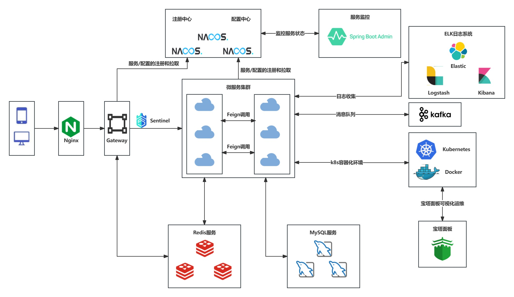
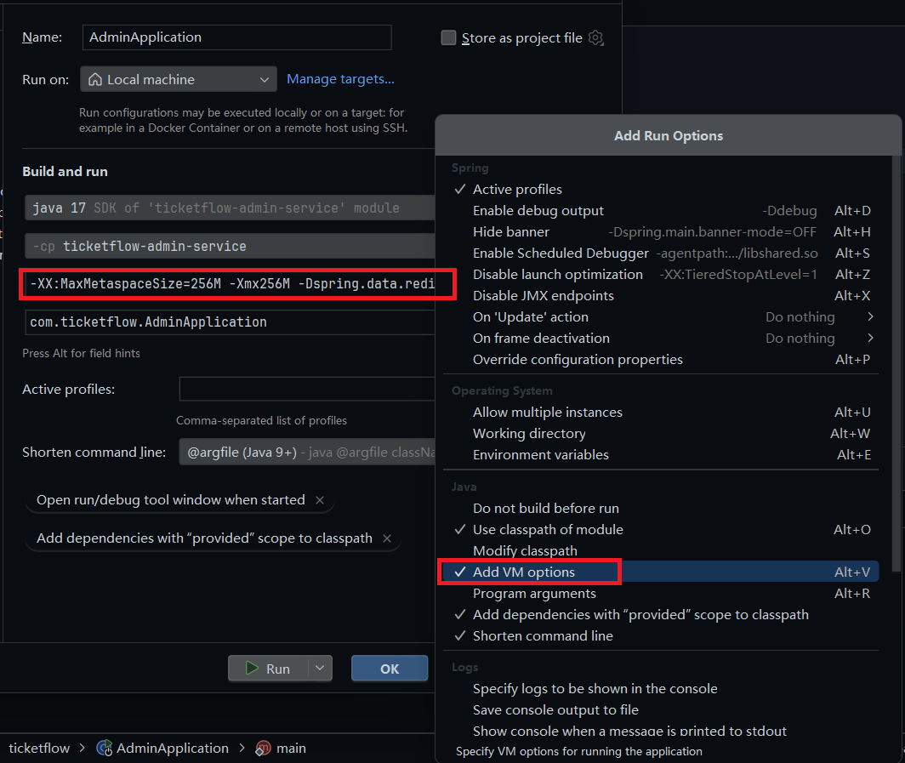

# TicketFlow

## 项目简介

「TicketFlow」TicketFlow是一个模仿大麦网的票务平台，使用SpringBoot、Spring Cloud、OpenFeign和Elasticsearch等技术栈开发。系统目前已实现用户注册、登录、查询节目、选座、购票、支付订单等核心业务，并采用分布式架构设计优化了系统性能，特别是在高并发购票场景下的处理能力。

## 技术架构

### 主要技术架构

- 使用了 **SpringCloud+SpringCloudAlibaba** 的微服务结构
- 使用了 **Nacos** 作为注册中心
- 使用 **Redis** 不仅仅作为缓存，还使用了`Lua脚本`/`延迟队列`/`Stream消息队列` 等高级特性
- 引入了 **Kafka** 消息中间件，**SpringBootAdmin** 作为服务的监控通知
- 通过**Elasticsearch**提供搜索和展示功能
- 使用 **ShardingSphere** 实现分库分表，来存储海量的数据

通过以上设计，来实现应对高并发、高吞吐的能力，以及海量数据的存储和服务状态的监控

### 技术架构图



## 模块说明

- **ticketflow-captcha-manage-framework**  验证码组件模块

  - **ticketflow-base-captcha** 验证码基础组件

  - **ticketflow-captcha-framework**  验证码封装组件

- **ticketflow-common**  公共基础包

- **ticketflow-elasticsearch-framework**  elasticsearch封装组件

- **ticketflow-id-generator-framework**  分布式id生成器

- **ticketflow-redis-tool-framework**  redis相关组件

  - **ticketflow-redis-common-framework** redis公共配置模块

  - **ticketflow-redis-framework** redis操作封装组件

  - **ticketflow-redis-stream-framework** redisStream操作封装组件

- **ticketflow-redisson-framework**  redisson封装组件 

  - **ticketflow-redisson-service-framework**  redisson服务相关组件 

    - **ticketflow-bloom-filter-framework**  布隆过滤器组件

    - **ticketflow-redisson-common-framework**  公共包

    - **ticketflow-repeat-execute-limit-framework**  防重复幂等组件

    - **ticketflow-service-lock-framework**  分布式锁组件

  - **ticketflow-service-delay-queue-framework**  延迟队列组件

- **ticketflow-server**  业务服务 

  - **ticketflow-admin-service**  admin服务监控

  - **ticketflow-base-data-service**  基础数据服务

  - **ticketflow-customize-service**  定制化服务

  - **ticketflow-gateway-service**  Gateway网关服务

  - **ticketflow-order-service**  订单服务

  - **ticketflow-pay-service**  支付服务

  - **ticketflow-program-service**  节目服务

  - **ticketflow-user-service**  用户服务

- **ticketflow-server-client**  业务服务的Feign调用 

  - **ticketflow-base-data-client**  基础数据服务的Feign调用

  - **ticketflow-customize-client**  定制化服务的Feign调用

  - **ticketflow-order-client**  订单服务的Feign调用

  - **ticketflow-pay-client**  支付服务的Feign调用

  - **ticketflow-program-client**  节目服务的Feign调用

  - **ticketflow-user-client**  用户服务的Feign调用

- **ticketflow-spring-cloud-framework**  微服务相关封装组件 

  - **ticketflow-service-common**  服务公共包

  - **ticketflow-service-component**  微服务公共包

  - **ticketflow-service-initialize**  服务初始化行为管理组件

- **ticketflow-thread-pool-framework**  线程池封装组件
- **logs**  日志存放目录
- **sql**  导入的数据库表和数据
- **images** 项目图片

## 快速启动

1. 添加 VM options 更改环境配置/更改 application.yaml 中的环境配置

   ```
   -XX:MaxMetaspaceSize=256M
   -Xmx256M
   -Dspring.data.redis.host=${redis地址}
   -Dspring.data.redis.password=${redis地址密码}
   -Dspring.cloud.nacos.discovery.server-addr=${nacos地址}:8848
   -Dspring.kafka.bootstrap-servers=${kafka地址}:9092
   -Delasticsearch.ip=${elasticsearch地址}:9200
   -Delasticsearch.userName=${elasticsearch账户}
   -Delasticsearch.passWord=${elasticsearch账户密码}
   -Dprefix.distinction.name=my
   ```

   

2. 运行项目

启动时需要将每个服务都启动起来，**BaseDataApplication**为基础服务所以要第一个启动，其余服务启动时没有先后关系。

**CustomizeApplication**为执行限流功能服务、**AdminApplication**为监听服务，这两个服务和业务服务分离，可以不启动
